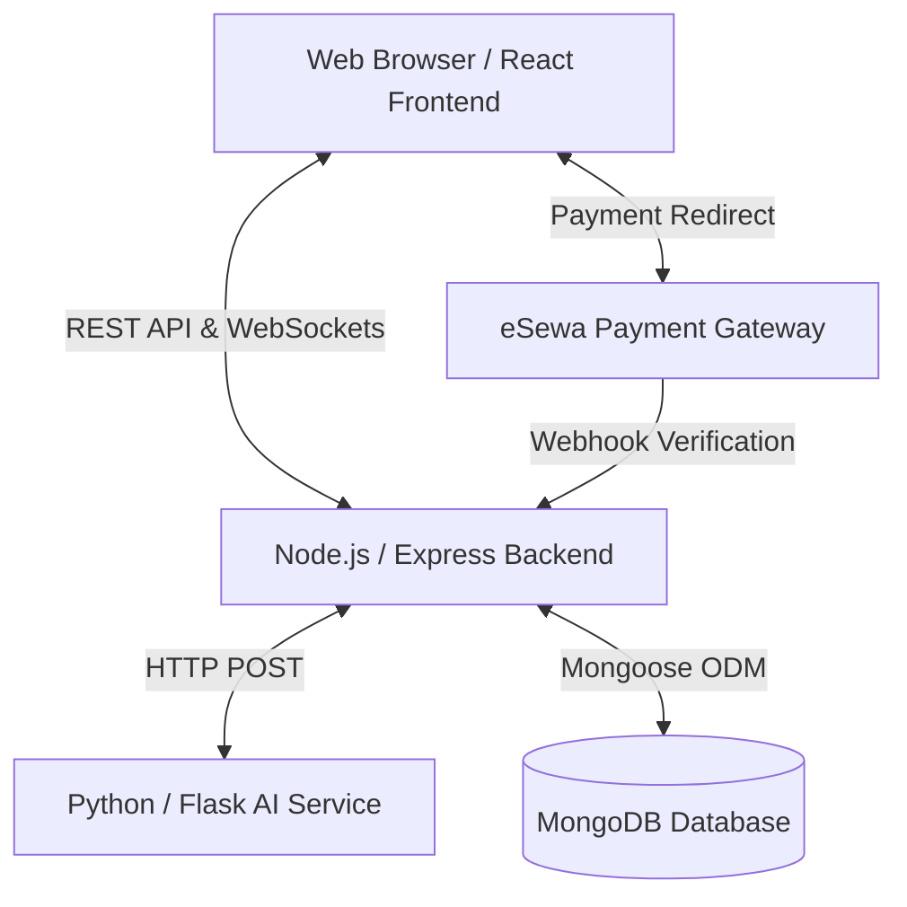

# Mental Health Platform - Technical Showcase

## Executive Summary
The **Mental Health Platform (MHP)** is a comprehensive, full-stack web application designed to connect patients with therapists, facilitate online consultations, and provide AI-assisted mental health screening. The platform leverages a modern microservices-inspired architecture, separating the client interface, core business logic, and machine learning capabilities into distinct, scalable services.

## System Architecture Overview

The system is built on a modern **MERN-variant** stack (MongoDB, Express, React, Node.js) combined with a dedicated Python service for Artificial Intelligence capabilities.

### 1. Frontend: Interactive User Interface
* **Location:** `/frontend`
* **Core:** React 18, Vite, TypeScript
* **Styling:** TailwindCSS 4, Radix UI primitives, Material-UI (MUI) icons
* **Animations:** Framer Motion (`motion`), tw-animate-css
* **Data Visualization:** Recharts
* **State Management & Routing:** React Router v7, React Hook Form (with Zod validation)
* **Features:** Responsive design, distinct dashboards for Patients and Therapists, real-time chat interface, animated landing pages, and interactive screening forms.

### 2. Backend: Core Business Logic & API
* **Location:** `/backend`
* **Core:** Node.js, Express.js, TypeScript
* **Database ODM:** Mongoose (MongoDB)
* **Real-time Communication:** Socket.io (for live chat during appointments)
* **Authentication:** JSON Web Tokens (JWT) for stateless authentication, Bcrypt for password hashing
* **Security & Validation:** Zod for request validation, custom error handling middleware
* **Features:** Role-based access control (Admin, Patient, Therapist), appointment scheduling engine, eSewa payment verification, and secure chat message routing.

### 3. AI Service: Machine Learning Engine
* **Location:** `/ai-service`
* **Core:** Python 3.11, Flask
* **Machine Learning:** Scikit-learn (TF-IDF Vectorizer + Linear Support Vector Classifier)
* **Data Processing:** NumPy, Pandas, Joblib (for model serialization)
* **Features:** Exposes a `/predict` REST endpoint. It analyzes patient-submitted text (e.g., journal entries or symptom descriptions) and predicts underlying mental health categories (e.g., Depression, Anxiety, Stress) while calculating confidence scores and recommending specific therapist specializations.

### 4. Database: Data Persistence
* **Core:** MongoDB Community Server
* **Structure:** Document-based NoSQL storage.
* **Collections (Mongoose Models):**
  * `User`: Core authentication and role data.
  * `PatientProfile` / `TherapistProfile`: Extended profile data linked to users.
  * `Availability`: Therapist working hours and specific slot management.
  * `Appointment`: Booking details linking a patient, therapist, and payment.
  * `Payment`: Transaction records linking to the eSewa gateway.
  * `ChatMessage`: Real-time conversation logs linked to specific appointments.
  * `Review`: Patient feedback and ratings for therapists.
  * `ScreeningResult`: Historical logs of AI predictions for patient tracking.

---

## Technical Implementation Highlights

### 1. Intelligent Weighted Matching
When a patient completes an AI screening, the text is analyzed by the Flask service to predict a mental health category. The backend then executes a **Weighted Categorical Scoring (WCS)** aggregation pipeline. This algorithm calculates a "Relevance Score" for every verified therapist based on:
*   **Clinical Match (10 pts):** Direct alignment with the AI prediction.
*   **User Preferences (5 pts each):** Matching the user's preferred gender, budget, and language.
Results are sorted by this score, ensuring the most relevant specialists are always presented first, even if some secondary preferences are not an exact match.

### 2. Real-Time Chat Infrastructure
Using `Socket.io`, the platform establishes a persistent WebSocket connection between the client and the backend. When an appointment is confirmed, a unique chat room (`appointment:${appointmentId}`) is created. Messages are simultaneously broadcasted to connected clients for instant delivery and saved to the MongoDB `ChatMessage` collection for historical persistence and read-receipt tracking.

### 3. Secure Payment Workflow
The platform integrates with **eSewa**. 
1. The backend generates a secure HMAC SHA-256 signature containing the transaction details and returns it to the frontend.
2. The frontend submits a form directly to eSewa's secure portal.
3. Upon completion, eSewa redirects the user back to the application, and the backend verifies the transaction details (`/api/payments/verify`) against the database before marking the appointment as `CONFIRMED`.

### 4. Database Migration Strategy
The project recently underwent a major architectural shift from **PostgreSQL/Prisma** to **MongoDB/Mongoose**. This transition involved:
* Replacing relational foreign keys with MongoDB `ObjectId` references.
* Converting complex SQL `JOIN` operations into optimized Mongoose `.populate()` queries.
* Restructuring the data models to take advantage of MongoDB's flexible document structure, particularly for array-based fields like therapist `specializations` and `languages`.

---

## Development & Deployment
The project is organized as a monorepo, allowing independent scaling of the frontend, backend, and AI service.
* **Local Development:** Developers use `npm run dev` in the frontend and backend, while running a Python virtual environment for the AI service. Local MongoDB handles data storage.
* **Environment Variables:** Strictly managed `.env` files ensure secure handling of JWT secrets, database connection strings, and AI service URLs.
* **Code Quality:** Enforced through ESLint, Prettier, and strict TypeScript compilation rules across both JavaScript codebases.
